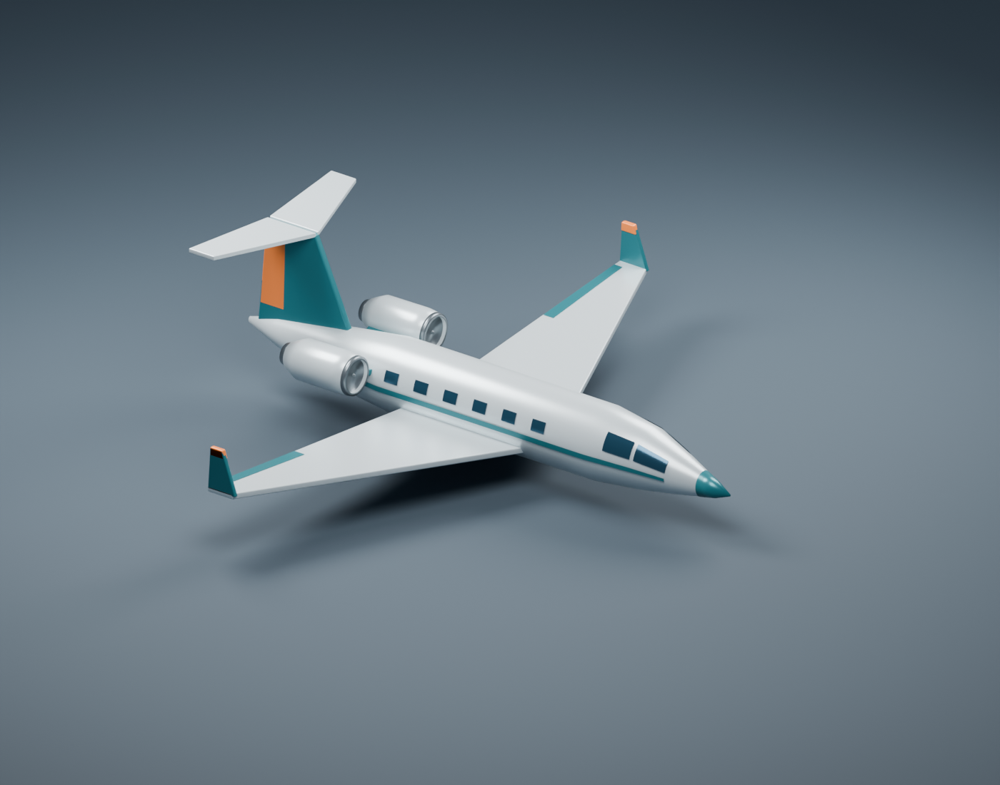

# Business jet

Basic light business jet with swept low wings, upright winglets, two rear-mounted
turbofans, cabin windows, and a T-tail. Pearl-gray, teal, and orange materials match
the existing fleet and require no external textures.



## Files

- [Editable Blender model](source/business_jet.blend)
- [Blender Python generator](source/create_business_jet.py)
- [Aircraft-only GLB](exports/business_jet.glb)
- [Studio preview](exports/business_jet_preview.png)

## Asset conventions

- Meters; exact 16 m wingspan, approximately 14.41 m length. Span matches
  `business_jet.plane.ron`; other dimensions are artistic approximations.
- Blender: +X nose, +Y right wing, +Z up. GLB: +X nose, +Y up, -Z right wing.
  The simulator uses `orientation: BlenderYUp` and `scale: 1.0` to rotate the
  export +90 degrees about X into the body frame.
- Root `business_jet` is at nominal CG `(0, 0, 0)`. All 70 aircraft mesh objects
  are children; 5,360 triangles and six embedded materials. Edge modifiers are baked.
- Named parts include wings, winglets, T-tail, cabin glazing, engine mounts,
  nacelles, intake rims, recessed fans, and exhausts.
- Static flight configuration; no landing gear, rig, animation, collision mesh,
  or additional LODs. Intersecting parts and decorative surface panels are intentional.
- Preview floor, camera, and lights occupy a separate collection, hidden in the
  modeling viewport and excluded from the GLB.

## Rebuild

From the repository root with Blender (generated using 5.2.1):

```sh
blender --background --python planes/business_jet/source/create_business_jet.py
```

The generator uses [shared Blender helpers](../../shared/aircraft.py) and replaces
the `.blend`, `.glb`, and preview. Save manual changes separately before rebuilding.
It checks wingspan, finite coordinates, nonzero triangle areas, and mesh parenting.
Run `just sync-models` in `ml_planes` afterward to refresh its runtime GLB.
