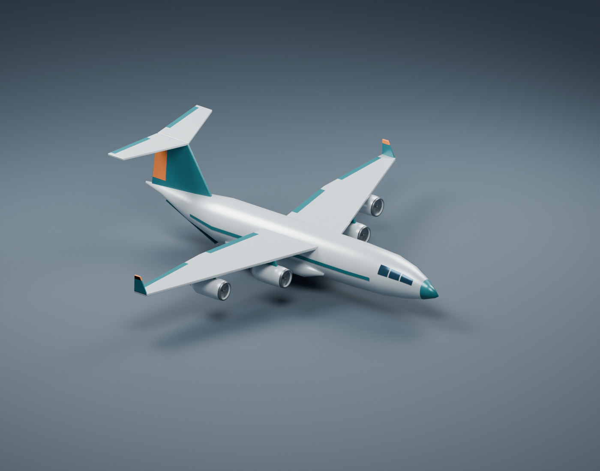
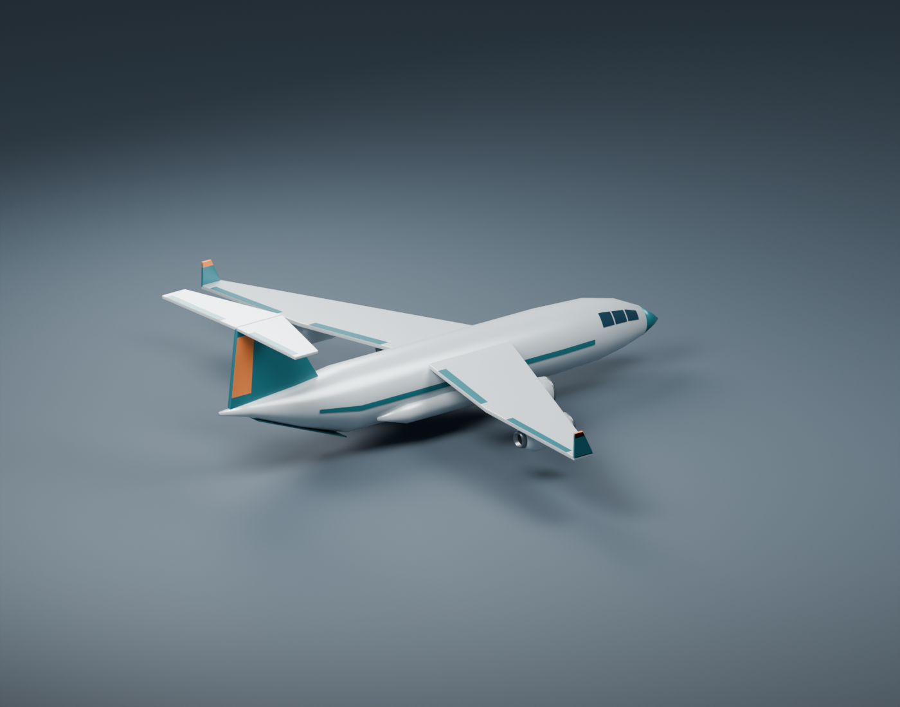

# Cargo jet

Basic heavy military airlifter with a broad freight fuselage, swept high wings,
four turbofans, upright winglets, gear sponsons, a tall T-tail, and a closed rear
cargo ramp. Pearl-gray paint with teal and orange accents matches the fleet.





## Files

- [Editable Blender model](source/cargo_jet.blend)
- [Blender Python generator](source/create_cargo_jet.py)
- [Aircraft-only GLB](exports/cargo_jet.glb)
- [Front preview](exports/cargo_jet_preview.png) and [rear preview](exports/cargo_jet_rear_preview.png)

## Asset conventions

- Meters; exact 52 m wingspan, approximately 47.52 m length. Span follows
  `cargo_jet.plane.ron`; other dimensions are artistic C-17-class proportions.
- Blender: +X nose, +Y right wing, +Z up. GLB: +X nose, +Y up, -Z right wing.
  The simulator uses `orientation: BlenderYUp` and `scale: 1.0` to rotate the
  export +90 degrees about X into the body frame.
- Root `cargo_jet` is at nominal CG `(0, 0, 0)`. All 105 aircraft mesh objects
  are children; 9,172 triangles and six embedded materials, with baked edge modifiers.
- Named engine parts include pylons, nacelles, intake rims, recessed fans, and
  exhausts. The `Closed rear cargo ramp` is a decorative panel, with no interior.
- Static flight configuration with gear retracted; no rig, animation, collision
  mesh, textures, or additional LODs. Mesh intersections are intentional.
- Studio floor, camera, and lights occupy a separate collection, hidden in the
  modeling viewport and excluded from the GLB.

## Rebuild

From the repository root with Blender (generated using 5.2.1):

```sh
blender --background --python planes/cargo_jet/source/create_cargo_jet.py
```

The generator uses [shared Blender helpers](../../shared/aircraft.py) and replaces
the `.blend`, `.glb`, and both previews. Save manual changes separately before rebuilding.
It checks wingspan, finite coordinates, nonzero triangle areas, and mesh parenting.
Run `just sync-models` in `ml_planes` afterward to refresh its runtime GLB.
