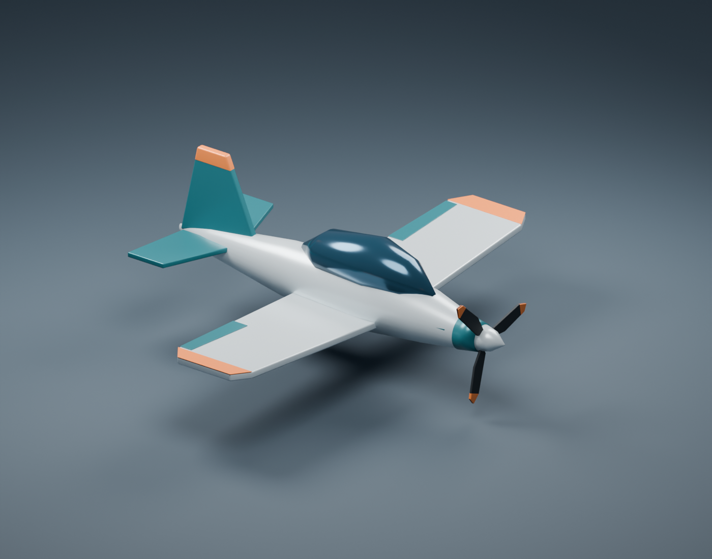

# Electric trainer

Basic battery-electric trainer with straight low wings, a bubble canopy,
conventional tail, compact motor cowling, and a three-blade tractor propeller.
Pearl-gray, teal, and orange materials match the existing fleet.



## Files

- [Editable Blender model](source/electric_trainer.blend)
- [Blender Python generator](source/create_electric_trainer.py)
- [Aircraft-only GLB](exports/electric_trainer.glb)
- [Studio preview](exports/electric_trainer_preview.png)

## Asset conventions

- Meters; exact 8 m wingspan, approximately 6.83 m length including the spinner.
  Span follows `electric_trainer.plane.ron`; other proportions are artistic choices.
- Blender: +X nose, +Y right wing, +Z up. GLB: +X nose, +Y up, -Z right wing.
  The simulator uses `orientation: BlenderYUp` and `scale: 1.0` to rotate the
  export +90 degrees about X into the body frame.
- Root `electric_trainer` is at nominal CG `(0, 0, 0)`. All 22 aircraft mesh
  objects are children; 3,168 triangles and five embedded aircraft materials.
  Edge modifiers are baked; the canopy is opaque smoked blue.
- Named parts include the motor cowling, spinner, three individual propeller
  blades and tip markings, wings, stabilizers, canopy, and motor access panels.
- Static flight configuration with no modeled landing gear, rig, propeller
  animation, collision mesh, textures, or additional LODs. Intersections and
  decorative surface panels are intentional.
- Studio floor, camera, and lights occupy a separate collection, hidden in the
  modeling viewport and excluded from the GLB.

## Rebuild

From the repository root with Blender (generated using 5.2.1):

```sh
blender --background --python planes/electric_trainer/source/create_electric_trainer.py
```

The generator uses [shared Blender helpers](../../shared/aircraft.py) and replaces
the `.blend`, `.glb`, and preview. Save manual changes separately before rebuilding.
It checks wingspan, finite coordinates, nonzero triangle areas, and mesh parenting.
Run `just sync-models` in `ml_planes` afterward to refresh its runtime GLB.
