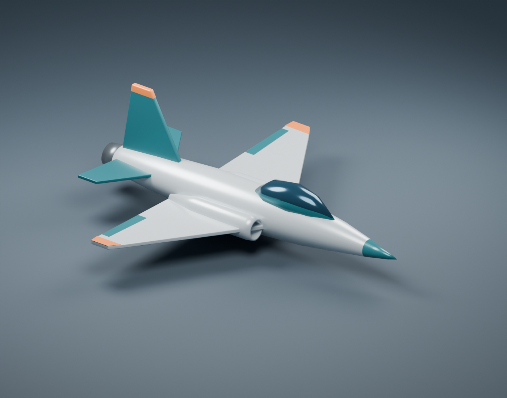

# Generic jet

Basic swept-wing, single-engine jet placeholder for `generic_jet.plane.ron`.
Includes a tapered fuselage, smoked canopy, two side intakes, recessed exhaust,
horizontal stabilizers, and a single vertical fin. Pearl-gray body with teal and
orange accents; opaque procedural material colors require no external textures.



## Files

- `source/generic_jet.blend`: editable named mesh parts and a separate preview studio.
- `source/create_generic_jet.py`: reproducible Blender Python generator.
- `exports/generic_jet.glb`: aircraft-only glTF 2.0 binary, with materials embedded.
- `exports/generic_jet_preview.png`: studio render.

## Asset conventions

- Meters; exact 10 m wingspan, approximately 11.06 m length. Dimensions other than
  span are artistic choices, not aerodynamic geometry derived from the config.
- Blender axes: +X nose, +Y right wing, +Z up, matching the simulator's body-axis labels.
- GLB uses Blender's standard Y-up conversion: +X nose, +Y up, -Z right wing.
  To recover the simulator's body coordinates, rotate the imported asset root
  +90 degrees about X before applying body attitude. This is a provisional
  integration convention; the simulator still uses gizmos.
- Root node: `generic_jet`, at a nominal center of gravity `(0, 0, 0)`.
  All mesh parts are children, with descriptive names such as `Fuselage`,
  `Wing_left`, `Wing_right`, and `Vertical stabilizer`.
- 20 mesh objects, 3,968 triangles, seven aircraft materials. Edge modifiers are
  baked. Parts intersect intentionally; this is a visual asset, not a watertight
  manufacturing model. The canopy is opaque reflective blue for simple rendering.
- Static flight configuration: no gear, rig, animated controls, collision mesh,
  textures, or additional LODs. Control-surface markings are decorative.
- Preview camera, floor, and lights are in a separate collection, hidden in the
  modeling viewport and excluded from the GLB.

## Rebuild

From the repository root, using Blender (generated with 5.2.1):

```sh
blender --background --python planes/generic_jet/source/create_generic_jet.py
```

The script replaces the generated `.blend`, `.glb`, and preview image. Save manual
model edits to a different filename before rebuilding. The generator checks the
wingspan and finite vertex coordinates before exporting.
