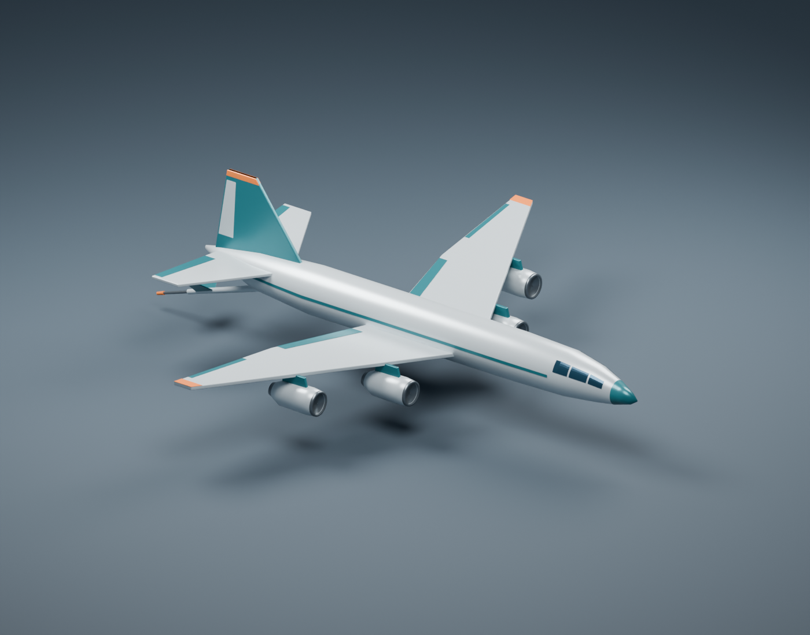
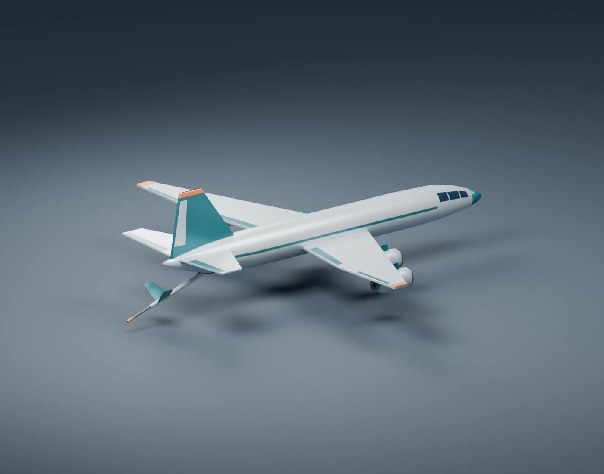

# Tanker

Basic four-engine aerial-refueling tanker for `tanker.plane.ron`, with a
KC-135R-class silhouette: long fuselage, swept low wings, underwing turbofans,
conventional tail, and a deployed centerline flying boom. Pearl-gray paint with
teal and orange accents matches the generic jet. Materials need no textures.





## Files

- `source/tanker.blend`: editable named mesh parts and a separate preview studio.
- `source/create_tanker.py`: reproducible Blender Python generator.
- `exports/tanker.glb`: aircraft-only glTF 2.0 binary with embedded materials.
- `exports/tanker_preview.png`: front three-quarter studio render.
- `exports/tanker_rear_preview.png`: rear view showing the refueling boom.

## Asset conventions

- Meters; exact 40 m wingspan, approximately 39 m fuselage length and 43.5 m
  overall length including the deployed boom. Span follows the simulation config;
  other dimensions are artistic choices, not an exact aircraft replica.
- Blender axes: +X nose, +Y right wing, +Z up, matching the simulator's body labels.
- GLB uses Blender's standard Y-up conversion: +X nose, +Y up, -Z right wing.
  Rotate the imported root +90 degrees about X to recover simulator body
  coordinates before applying body attitude. This convention is provisional;
  the simulator still uses gizmos.
- Root node: `tanker`, at nominal center of gravity `(0, 0, 0)`. All aircraft
  meshes are children, including `Refueling boom`, `Boom telescoping tube`,
  `Boom nozzle`, and the four named engine assemblies.
- 107 mesh objects, 9,120 triangles, six aircraft materials. Edge modifiers
  are baked. Parts intersect intentionally; this is a basic visual asset.
  Cockpit windows, fan blades, and livery are decorative mesh panels.
- Static flight configuration with a deployed boom; no gear, animation, rig,
  collision mesh, or additional LODs. Boom position is illustrative and is not
  a calibrated docking point for the refueling controller.
- Preview floor, camera, and lights are hidden in the modeling viewport and
  excluded from the GLB.

## Rebuild

From the repository root, using Blender (generated with 5.2.1):

```sh
blender --background --python planes/tanker/source/create_tanker.py
```

Rebuilding replaces the generated `.blend`, `.glb`, and both preview images.
Save manual edits under a different filename before rebuilding. The generator
checks wingspan, finite coordinates, and mesh parenting before exporting.
